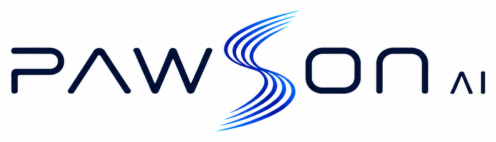
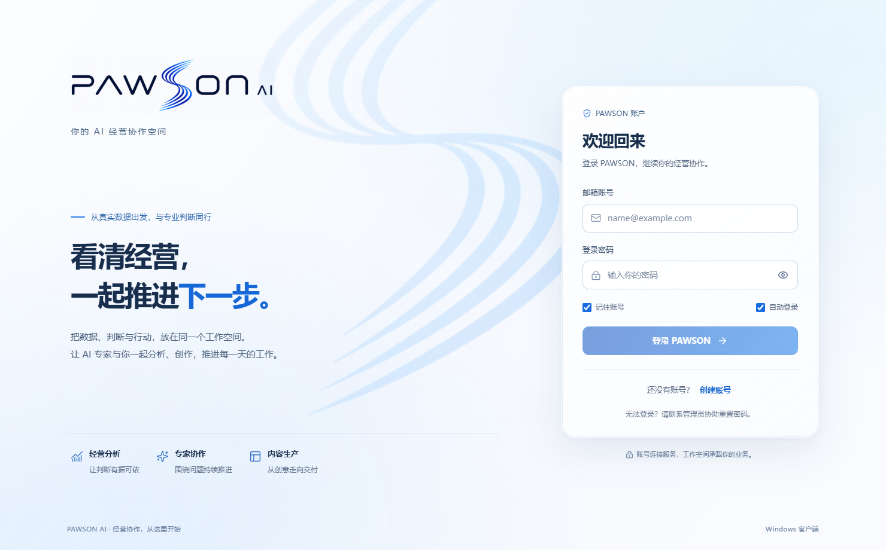

  <strong>简体中文</strong> · <a href="README_EN.md">English</a>

# 派笙 AI 中台 · 公开开发日志

### 让经营分析、专家协作与内容生产，在一个本地优先的工作空间持续推进

记录 PAWSON AI 从商品视觉工具到综合 Agent 平台的真实开发过程。

  
  
  
  
  

**[开发历程](docs/development-history.md)** · **[项目图片](screenshots/README.md)** · **[最新进展](updates/2026-09-10.md)** · **[版本记录](releases/)** · **[公开路线图](ROADMAP.md)**

---

> **快速到达：** 🚀 [最新开发进展 · 2026-09-10](updates/2026-09-10.md)　·　📅 [逐日开发历程](docs/daily-development-history.md#latest)

派笙 AI 中台 2.0 · Windows 客户端 · 2026-09-09

## 快速导航

| 想了解什么 | 直接前往 |
| --- | --- |
| 📖 **项目是怎样一路做出来的** | [完整开发历程](docs/development-history.md) |
| 🖼️ **查看真实产品界面与演进对比** | [项目图片集](screenshots/README.md) |
| 🗓️ **按日期查看每个阶段做了什么** | [开发日记](updates/README.md) |
| 📅 **从第一天连续看到最新一天** | [完整逐日开发历程](docs/daily-development-history.md#latest) |
| 🚀 **查看公开版本与交付边界** | [版本记录](releases/README.md) |
| 🧭 **了解当前进度和下一步方向** | [公开路线图](ROADMAP.md) |
| 📝 **快速浏览全部产品变化** | [更新日志](CHANGELOG.md) |

## 30 秒了解 PAWSON AI

| 经营分析 | 专家协作 | 内容生产 |
| --- | --- | --- |
| 连接可信经营数据，区分事实、推断和待验证原因 | 视觉诊断、经营分析与文档交付方法进入同一 Agent 工作区 | 从商品素材、图片处理和模板套图走向可恢复的项目工作流 |

PAWSON AI 是面向跨境电商与内容经营场景的 Windows 桌面工作台。它让 AI 在用户授权范围内读取业务上下文、调用专业能力、处理真实文件，并把结果继续送入软件内部流程。

项目坚持本地优先、证据可追溯、敏感操作需审批、失败后可恢复。界面显示“完成”不代表业务成功，文件、状态和外部服务结果都需要真实验证。

## 当前进度

> **正在推进：AI 商业接入与请求级验证**
>
> 最新隔离实验共 16 个用例，15 个通过、1 个发现取消传播缺口。现有 Agent 内核继续保留；实际网关协议、供应商计量关联和多企业并发仍待后续验证。

从 2026 年 7 月底到 9 月初，私人源码仓库已形成 315 个真实提交。产品从商品图片生产工具，逐步扩展出数据中枢、经营驾驶舱、知识库、项目工作区、统一 Agent 入口和专家能力，并在 2026-09-09 进入派笙 AI 中台 2.0 阶段。

## 开发时间线

| 阶段 | 产品变化 | 详细记录 |
| --- | --- | --- |
| 2026-07 | 完成首个 Windows 交付包和核心商品图片生产链路 | [从能运行到能交付](updates/2026-07-25.md) |
| 2026-08 | 跨境模块先完成离线闭环，明确真实平台验收边界 | [跨境模块验证](updates/2026-08-04.md) |
| 2026-08 | 报告开始成为可复核、可继续流转的交付物 | [报告交付节点](updates/2026-08-12.md) |
| 2026-08 | 将工具整合为项目、数据、经营与任务工作台 | [Agent MVP](updates/2026-08-21.md) |
| 2026-08 | 连接采集、数据资产、知识库和商品项目 | [数据链路节点](updates/2026-08-26.md) |
| 2026-09 | Agent 获得受控命令、长任务、文件和办公能力 | [处理真实工作](updates/2026-09-01.md) |
| 2026-09 | 接入正式 Agent 运行时与三类专家方法 | [综合 Agent 里程碑](updates/2026-09-06.md) |
| 2026-09 | 收口任务交互、经营上下文和运行诊断三项架构 | [三项架构收口](updates/2026-09-07.md) |
| 2026-09 | 建立通用 AI 网关首条链路和短期授权边界 | [通用 AI 网关](updates/2026-09-08.md) |
| 2026-09 | 品牌与主链路升级到派笙 AI 中台 2.0 | [2.0 阶段记录](updates/2026-09-09.md) |
| 当前 | 验证身份、重试、用量、取消和异常恢复边界 | [P0 实验结果](updates/2026-09-10.md) |

## 关于这个公开仓库

这里公开产品演进、用户价值、验证结果、开发取舍和经过检查的项目图片。它是一份持续更新的开发故事，不是私人源码仓库的镜像。

私人仓库中的源代码、完整架构、内部接口、数据库结构、部署配置、系统提示词、凭证、客户信息和可复刻核心实现不会进入这里。

后续更新沿用 [开发日记模板](updates/TEMPLATE.md) 的事实与脱敏检查。本仓库不提供产品源代码许可，详见 [LICENSE](LICENSE)。
