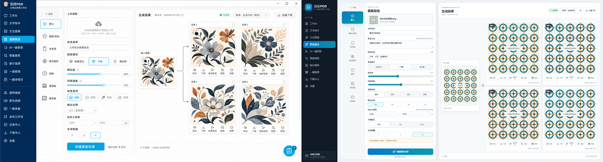
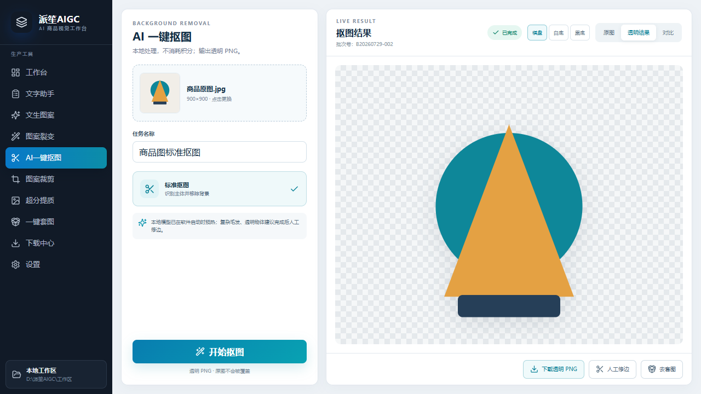
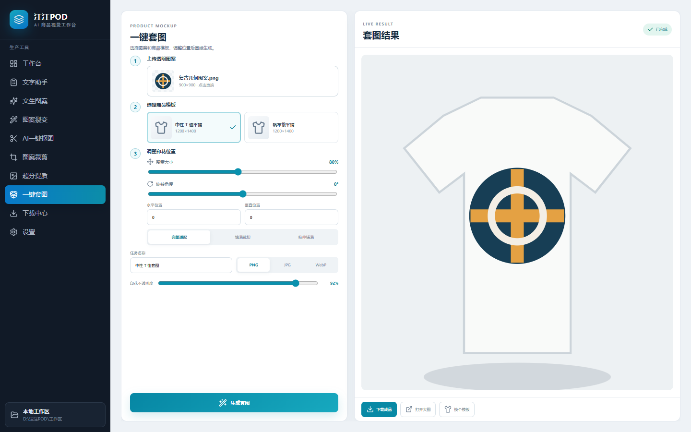
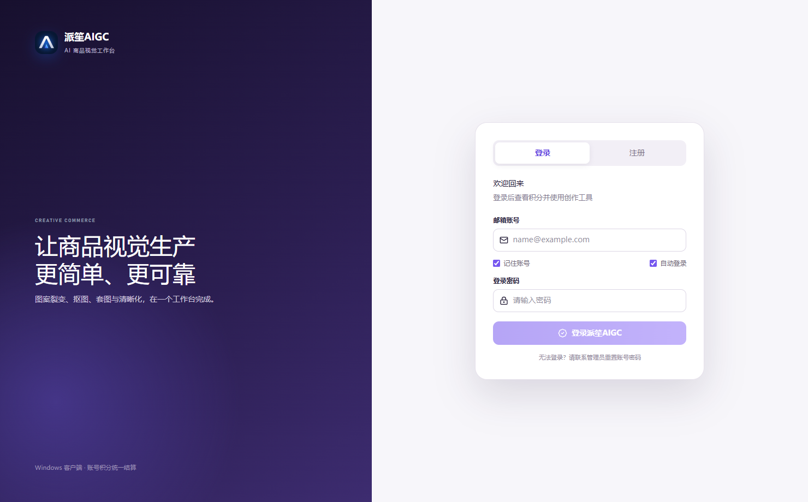

# PAWSON AI Product Gallery

[简体中文](README.md) · **English**

These images were selected from local development and isolated test outputs. Visible content and metadata were reviewed before publication. They contain no real accounts, customer data, credentials, or server configuration.

## July 2026: product-visual production

### Pattern variation evolution

The left side shows an earlier result layout. The right side reorganizes parameters, the source image, and candidate results. All artwork is test material.

### Local background removal

Transparent output, original-image comparison, download, and manual refinement are kept in one workspace.

### Product mockups

An early workspace for product placement, scale, opacity, and export format.

## August 2026: agent prototype

At this point the product still used the PAWSON AIGC identity and focused on bringing product-visual work into one agent workspace.

## September 2026: PAWSON AI Platform 2.0

The 2.0 stage expands the product story into one workspace for business intelligence, expert collaboration, and content production.

## Three expert disciplines

| Lingjing · Visual diagnosis | Guheng · Business analysis | Jianning · Document delivery |
| --- | --- | --- |
|  |  |  |

The characters help users identify professional methods. They do not represent fictional human employees.
